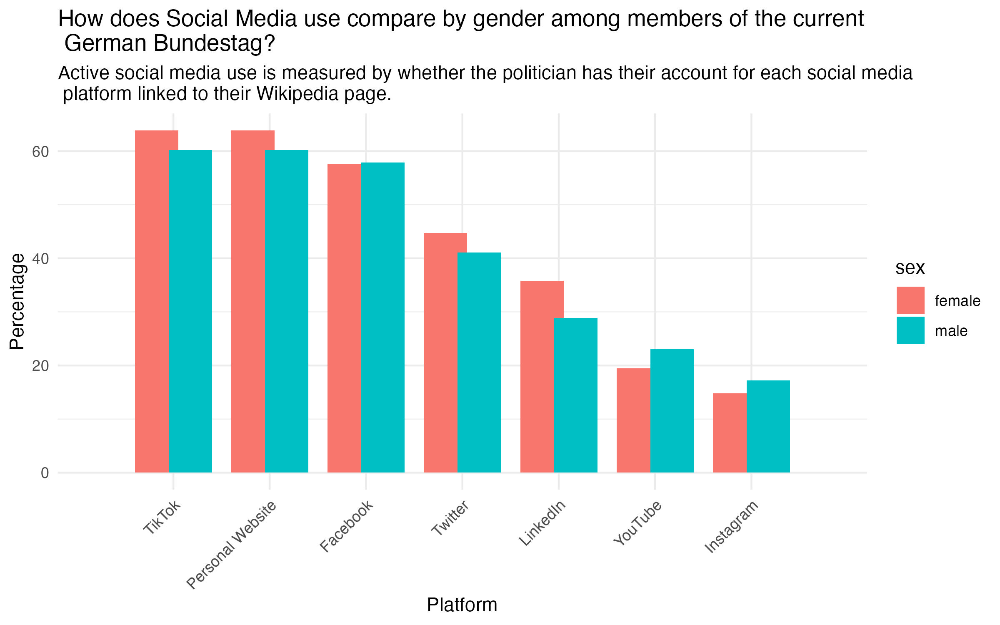
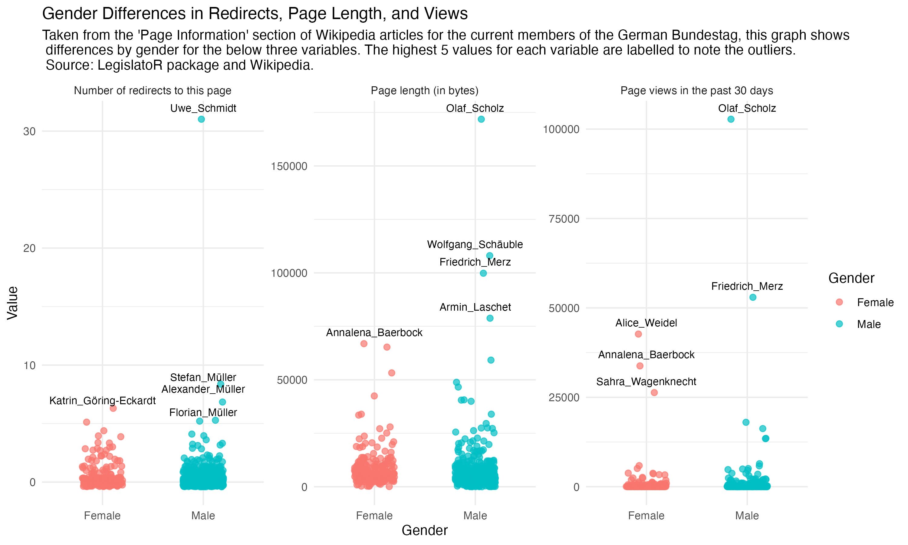

<style>
h1.title {
  color: black;
}
</style>

```{r setup, include=FALSE}
knitr::opts_chunk$set(echo = FALSE, warning = FALSE, message = FALSE)
library(knitr)
```

Have you seen any German politicians appear on your Instagram or TikTok feeds lately? If you haven’t yet, there is a good chance that you might in the next few months. With elections called for Germany in February 2025, following the recent dramatic collapse of the governing coalition, we can expect politicians to be campaigning for re-election on all types of platforms and formats, and, in today’s digital world, increasingly via the use of digital platforms and social media. We know that gender disparities manifest for female politicians in a number of ways – does this also extend to their presence and visibility in the digital world? Although it may seem outdated, we can use data from one of the most longstanding digital platforms to explore this question: Wikipedia.  

# Exploring Gender Inequality in Digital Visibility and Representation

The German Bundestag is composed by 734 members, 255 of whom are women. This translates to a quota of 34.7%, meaning that women are still considerably underrepresented. With this gender ratio, the current Bundestag represents a continuation of the pattern visible in previous legislative periods: After steady growth in the 1980s and 1990s, the share of female parliamentarians has stagnated at 30-35% since the early 2000s (Matt 2021). But why has that been the case? When it comes to  possible explanations and solutions for this inequality, the German public debate is often centered around party politics. This is because German political parties are considerably different with regard to their share of female parliamentarians and their policies on how to handle a possible underrepresentation of women. The Greens (Die Grüne) and the Left (Die Linke) have the most rigid approach and are, at the same time, the parties with the most women. Both have committed to have at least 50% of women on their candidate list, resulting in a share of female parliamentarians slightly exceeding 50%. The FDP (Freie Demokraten) and the AfD (Alternative für Deutschland) are on the other end of the spectrum, albeit extreme in terms of gender parity, with no quota for women on their candidates lists (Matt 2021). 

In the light of the upcoming elections, we want to explore a different possible reason, which is digital visibility. Although we will not be able to explore the causal nature of the relationship in this text, it seems plausible that people are more likely to vote for a candidate they know. Hence, digital visibility is of utmost importance for parliamentarians to be (re-)elected. Using data from the LegislatoR database, we explore parliamentarians' presence on different social media platforms, how long their Wikipedia articles are and how frequently they are being visited. This allows us to answer the question of whether and how the digital visibility of male and female MdB members differs in Germany. We contextualize our descriptive analysis with additional findings from academic literature. 

# What can we find by looking at data from Wikipedia pages?

Gender disparities on Wikipedia have been well-researched during the last years. The underrepresentation of women both in the articles as well as in the editing community have led the Wikimedia foundation and activists to take action, for instance, by hosting “edit-a-thons", aiming to provide an accessible environment in which new articles about members of marginalized communities are created together (Tripodi 2023).  

With regard to biographies, the gender disparities manifest as follows: Women who have their own Wikipedia biography are on average slightly more “notable” than men with their own biography. This can be interpreted as women having to achieve more until they are considered important enough to receive an article (Wagner et al. 2016). There are several possible reasons behind this: first, the mostly male community of Wikipedia authors might be more prone to write about other men. At the same time, men might be more confident than women about their own successes, making them more likely to write their own article. Moreover, women's lives tend to be less well-documented on the Internet, which makes it harder to find enough secondary sources about them to write the article. Less digital visibiltiy might also make it harder for women biographies to pass the relevance assessment biographies, thus making it more likely to be deleted due to lack of relevance  (Wagner et al. 2016). This is supported by the finding of Tripodi (2023) suggesting that community reviewers of women’s biographies are more likely to propose deleting the former due to a lack of perceived relevance (Tripodi 2023). While the study of Wagner et al. (2016) highlights contextual factors that women are underrepresented on Wikipedia, Tripodi (2023) makes a strong case that the general decision criteria of Wikipedia for whether someone deserves an article are interpreted more strictly for women than for men. 

## Wikipedia Article Length

Looking at the Wikipedia articles of German MdBs, it first comes to attention that all current and former members have an article. A possible reason for this is that their parliamentarian status serves as a “hard” criterion that backs their relevance.  
 
The graph below compares the length of the Wikipedia article’s introduction for male and female parliamentarians. To do this, we scraped the article’s introduction and reported their word count as a proxy for the overall article length and detailedness. The average introduction lengths are very similar, being roughly 44 words for both men and women. The distribution, however, shows a gender difference, with most women’s articles having an introduction of below or around 50 words, whereas among men, articles tend to have 100 to 200 words in their introduction.  

Analyzing the article’s metric in the graph below, we see a similar pattern. While the means of the distributions are similar and both rather on the low end, among males there are more outliers with higher values than among females. While the visibility of “average” parliamentarians could be similar, this could mean that there are more male than female MdB members  with high visibility. 

```{r}
knitr::include_graphics("Wikipedia_intros.jpeg")
```


## Social Media Presence 

Social media is often seen as a tool that female politicians can use to counter biased representation with which they might struggle otherwise. For instance, media coverage has been found to often stress female politicians' role as mother in an over proportional way, making them appear less competent in their role as politicians (Chen et al. 2020, p. 21). Hence, social media provides women with the possibility to present themselves as they wish. Moreover, they seem to be more successful than men to get attention on social media: Yarchi and Samuel-Arzan (2017) found that during the 2015 election campaign in Israel, female candidates generated more interactions, such as likes or shares, than men with the same number of followers. At the same time, women might be more hesitant to use social media due to fear or experiences of hate speech. This concern is backed up by a study showing how female politicians with high visibility indeed receive an overproportional number of uncivil messages (Rheault et al. 2017).  

While our data does not allow us to investigate why women choose to be present (or not to be present) on social media, or how active MdB members are actually utilizing their social media accounts, it does suggestthat women MdBs i seem to have recognized the positive potentials of social media for them. As the bar chart shows, on four out of the seven platforms, the share of female parliamentarians with an account is higher than the share of males. For example, 63% of female MdBs are active on TikTok, compared to only 60% of men. The same applies for the usage of a personal website. LinkedIn has the largest gender gap with 36% of women having an account and only 29% of men. YouTube and Instagram, on the other hand, are more used by men (23% having a YouTube account and 17% being active on Instagram) compared to  women (19 % and 15%, respectively). 

```{r}

```

## Metrics for Wikipedia Page Visibility

So, for a majority of social media platforms, female MdBs have more social media accounts linked to their Wikipedia than male members.  Is it possible that the use of social media and other platforms has an effect on their Wikipedia pages themselves? While we do not treat or  isolate this effect, we can explore whether there any differences between female and male parliamentarians in Germany in the following metrics: 

- How many other pages redirect to their Wikipedia page? 

- How long is their whole Wikipedia page (measure in bytes)? 

- How many views has their Wikipedia page had in the past 30 days (measured as of 18 December 2024)?  

The answers to this are summarised in the following graph: 


```{r}

```

Immediately, we can see that some of the most visited Wikipedia pages in the past month are for high-profile figures involved in the recent collapse of the coalition government (Olaf Scholz and Friedrich Merz). For all metrics, we can see that the highest values (the page with the most redirects, the longest article, and the most visited page) all correspond to male parliamentarians. Overall, we can see that the distribution for male members of parliament skews slightly higher than for female members for all three metrics.  

# Conclusion 

In a nutshell, there are gender differences among German parliamentarians' visibility in the digital space. Analyzing the Wikipedia articles’ introductions and meta data reveals that while the averages are similar. Yet the male distributions are more spread out towards higher values, meaning that there are more men than women receiving high public attention. Social media, on the other hand, reflects a different story.Here, women are more active than men in four out of the seven analyzed platforms. The reason behind that is likely that social media platforms offer women the possibility to choose how they want to appear, making them valuable tools to counter biased representation on other platforms, such as Wikipedia or classical media. However, despite being more present on a higher number of platforms, overall the Wikipedia pages of female parliamentarians are slightly shorter, have less redirects, and have received less visits in the past 30 days than those of male members.  

The gender differences we have explored through this data may not seem to immediately present a huge gap in digital platform presence by male and female members of the German parliament  yet their critical when considering how many small disparities  pile up and could lead to larger disparities in gender balance of the Parliament over time.  

# References 

Chen, D., Park, K., & Joo, J. (2020). Understanding Gender Stereotypes and Electoral Success from Visual Self-presentations of Politicians in Social Media. In ATQAM/MAST’20: Joint Workshop on Aesthetic and Technical Quality Assessment of Multimedia and Media Analytics for Societal Trends (pp. 21–25). https://doi.org/10.1145/3423268.3423583 

Matt, E. (2021, October 12). Weiblicher und jünger. mitmischen.de - Dein Portal Zum Deutschen Bundestag. https://www.mitmischen.de/archiv/weiblicher-und-junger 

Rheault, L., Rayment, E., & Musulan, A. (2019). Politicians in the line of fire: Incivility and the treatment of women on social media. Research & Politics, 6(1). https://doi.org/10.1177/2053168018816228 

Tripodi, F. (2021). Ms. Categorized: Gender, notability, and inequality on Wikipedia. New Media & Society, 25(7), 1687–1707. https://doi.org/10.1177/14614448211023772 

Wagner, C., Graells-Garrido, E., Garcia, D., & Menczer, F. (2016). Women through the glass ceiling: gender asymmetries in Wikipedia. EPJ Data Science, 5(1). https://doi.org/10.1140/epjds/s13688-016-0066-4 

Yarchi, M., & Samuel-Azran, T. (2018). Women politicians are more engaging: male versus female politicians’ ability to generate users’ engagement on social media during an election campaign. Information Communication & Society, 21(7), 978–995. https://doi.org/10.1080/1369118x.2018.1439985 
